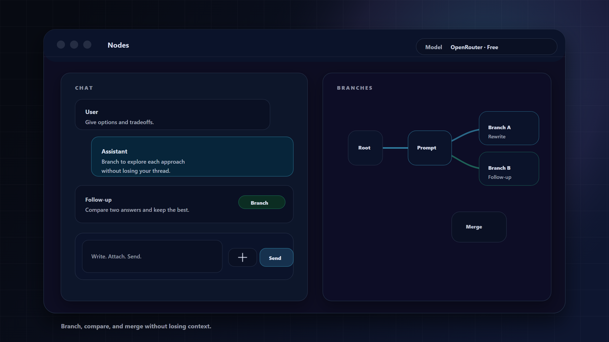
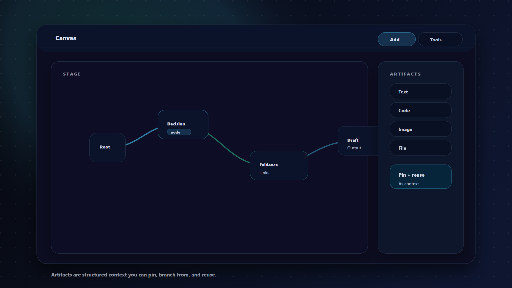
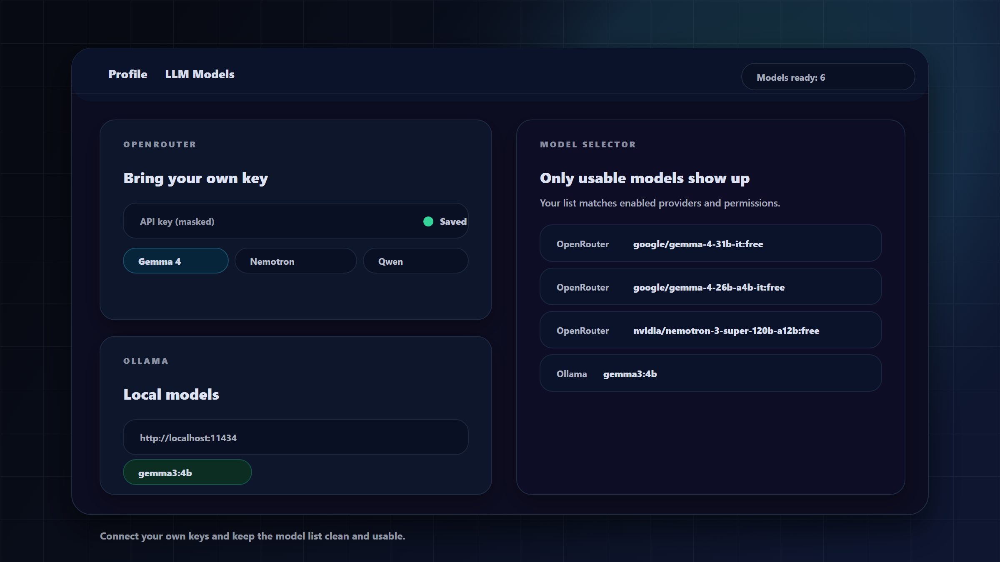

<p align="center">
  
</p>

<h1 align="center">Nodes</h1>

<p align="center">
  A branching chat and a visual canvas for thinking with AI.
</p>

<p align="center">
  <a href="https://github.com/Daedu86/Nodes-AI-Canvas/actions/workflows/ci.yml"></a>
  <a href="https://github.com/Daedu86/Nodes-AI-Canvas/actions/workflows/codeql.yml"></a>
  <a href="LICENSE"></a>
</p>

<p align="center">
  
</p>

Nodes is a workspace for exploration, comparison, and decision-making—not just a single-answer chatbot.

Instead of forcing every idea into one linear conversation, Nodes helps you:

- Branch and compare different prompt directions.
- Keep a canvas open for reusable context such as artifacts, decisions, drafts, and evidence.
- Promote the best result into shared session or project memory.
- Connect hosted OpenRouter models or local Ollama models from the same interface.

## Why Nodes instead of a linear chat?

| Linear chat | Nodes |
| --- | --- |
| One conversation path | Parallel branches from any message |
| Important context disappears in scrollback | Persistent Canvas with pinned context and artifacts |
| Alternatives are compared manually | Arena compares branches and sessions side by side |
| Decisions stay isolated in one thread | Session and project memory carry outcomes forward |

## What is the Canvas?

The Canvas is a visual, persistent space that lives alongside chat. It is designed for the parts of AI work that should not disappear in scrollback: key decisions, constraints, evidence, reusable context, and outputs.

## Product Tour

### Chat + branching

<picture>
  <source media="(prefers-color-scheme: dark)" srcset="docs/readme/01-chat-branching-dark.png" />
  <source media="(prefers-color-scheme: light)" srcset="docs/readme/01-chat-branching.png" />
  
</picture>

Branch from any user or assistant message by editing it or adding a follow-up, then keep parallel paths side by side.

### Canvas + artifacts

<picture>
  <source media="(prefers-color-scheme: dark)" srcset="docs/readme/02-canvas-artifacts-dark.png" />
  <source media="(prefers-color-scheme: light)" srcset="docs/readme/02-canvas-artifacts.png" />
  
</picture>

Artifacts—text, code, images, and files—are structured context you can pin and reuse across branches and projects.

<p>
  
</p>

### Arena

Arena is where you compare branches or sessions side by side and promote the best result into memory.

<p>
  
</p>

### Project Context Builder

Projects accumulate shared context over time. The Context Builder composes project-wide guidance from Arena outcomes, typed Canvas nodes, and session summaries.

<p>
  
</p>

### Per-user LLM connections

<picture>
  <source media="(prefers-color-scheme: dark)" srcset="docs/readme/04-llm-models-dark.png" />
  <source media="(prefers-color-scheme: light)" srcset="docs/readme/04-llm-models.png" />
  
</picture>

Users can connect their own provider credentials and control which models appear in the selector. Stored credentials remain server-side and can use a dedicated encryption key in production.

## What You Can Do

- Create sessions and branch from user or assistant messages.
- Keep a Canvas open while you chat.
- Pin nodes, artifacts, evidence, and decisions.
- Group sessions into projects with shared context.
- Compare alternatives in Arena and promote winners into memory.
- Collaborate through project membership and secure invitations.
- Read Knowledge Center documentation inside the workspace.
- Use hosted OpenRouter models or local Ollama models.

## Getting Started as a User

1. Create a **session** from the sidebar.
2. Pick a model from the top selector.
3. Chat normally, then use **Edit** or **Follow-up** to create a branch.
4. Open **Canvas** to keep important context visible.
5. Add artifacts when structured context matters more than another message.
6. Open **Profile → LLM Models** to connect your provider credentials and choose available models.

## Common Use Cases

- **Product and UX iteration:** branch prompts, compare outcomes, and retain the strongest direction.
- **Technical design:** keep evidence, snippets, constraints, and decisions attached to the same workspace.
- **Research:** pin sources, draft summaries, compare interpretations, and carry context across sessions.
- **Writing and planning:** explore alternatives without losing previous versions or decisions.

## Architecture at a Glance

- **Application:** Next.js, React, and TypeScript.
- **AI runtime:** Vercel AI SDK with OpenRouter and Ollama provider support.
- **Authentication:** Auth.js with GitHub or Google OAuth in production.
- **Persistence:** local file repositories for development or Supabase Postgres and Storage for cloud deployments.
- **Canvas:** React Flow-based visual workspace.
- **Quality:** ESLint, TypeScript, Vitest coverage, Playwright E2E, dependency audits, and CodeQL.
- **Deployment:** Vercel with production environment validation that fails closed on unsafe configuration.

## Key Ideas

- **Session:** a working conversation that can be reopened later.
- **Branch:** a parallel path created from any message.
- **Artifact:** structured context such as text, code, an image, or a file.
- **Project:** a workspace that groups sessions and shared context.
- **Arena:** a comparison surface for branches and sessions.
- **Memory:** promoted context that remains available beyond one branch.

## Developer Quick Start

Requirements:

- Node.js 22
- npm
- OpenRouter or Ollama

```bash
npm ci
cp .env.example .env.local
npm run dev
```

On Windows PowerShell, replace the copy command with:

```powershell
Copy-Item .env.example .env.local
```

Then open `http://localhost:3000`.

For complete setup and validation commands, see the [development guide](docs/development.md). For production configuration, see the [deploying guide](docs/deploying.md) and [cloud persistence guide](docs/cloud-persistence.md).

## Contributing

Contributions should include focused changes, appropriate tests, and a clear description of user-visible or operational impact. Read [CONTRIBUTING.md](CONTRIBUTING.md) before proposing a change.

Security vulnerabilities should not be reported in public issues. Follow [SECURITY.md](SECURITY.md) for private reporting instructions.

## Project Status

Nodes is under active development. Interfaces, persistence details, and operational defaults may continue to evolve before a stable `1.0` release.

## License

This project is licensed under the MIT License.

See [LICENSE](LICENSE) and [THIRD_PARTY_NOTICES.md](THIRD_PARTY_NOTICES.md) for upstream notices related to `assistant-ui`.
