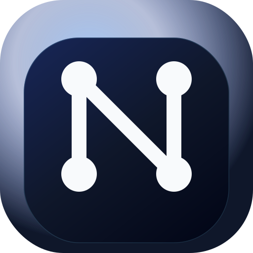
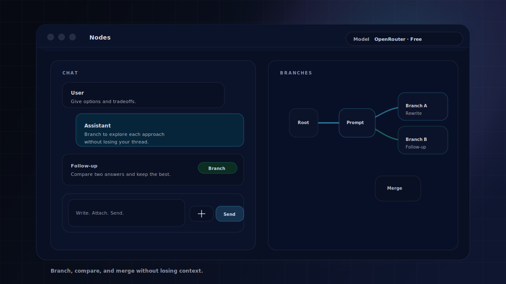
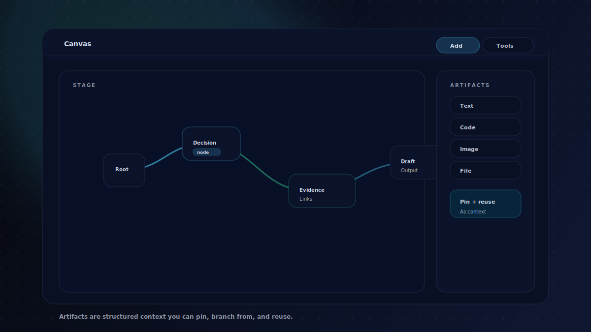
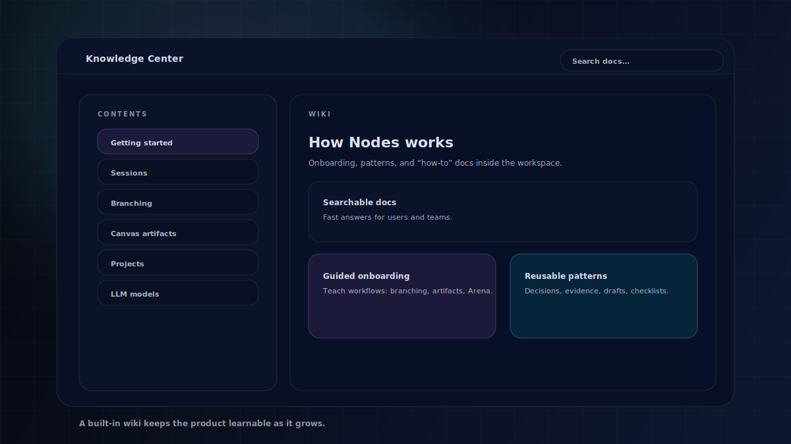
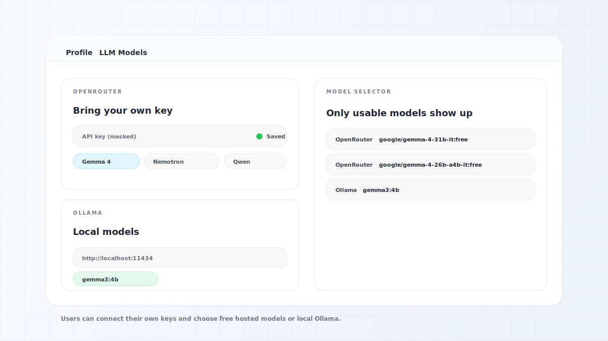

  

<h1 align="center">Nodes</h1>

  A branching chat and a visual canvas for thinking with AI.

  

Nodes is a workspace for exploration, not just a single-answer chatbot.

Instead of forcing everything into one linear chat, Nodes helps you:

- Branch and compare different prompt directions.
- Keep a canvas open for reusable context (artifacts, decisions, drafts, evidence).
- Promote the best result into shared memory (session or project) so you can keep moving.

### What is the Canvas?

The Canvas is a visual, persistent space that lives alongside chat. It’s designed for the parts of AI work that *shouldn’t* disappear in scrollback: key decisions, constraints, evidence, and outputs you want to reuse.

### What is Nody?

Nody is the built-in guide that can read your current session tree + canvas context and help you:

- Summarize a branch or the whole session.
- Explain what you’re looking at (selected node / edge / artifact).
- Suggest next steps when you’re stuck.

## Product Tour

### Chat + branching

<picture>
  <source media="(prefers-color-scheme: dark)" srcset="docs/readme/01-chat-branching-dark.svg" />
  <source media="(prefers-color-scheme: light)" srcset="docs/readme/01-chat-branching.svg" />
  
</picture>

Branch from any message (edit or follow-up) and keep parallel paths side by side.

### Canvas + artifacts

<picture>
  <source media="(prefers-color-scheme: dark)" srcset="docs/readme/02-canvas-artifacts-dark.svg" />
  <source media="(prefers-color-scheme: light)" srcset="docs/readme/02-canvas-artifacts.svg" />
  
</picture>

Artifacts (text, code, images, files) are structured context you can pin and reuse across branches and projects.

  

### Arena (compare sessions/branches)

Arena is where you compare directions side-by-side and promote the best result into memory.

  

### Knowledge Center (built-in wiki)

<picture>
  <source media="(prefers-color-scheme: dark)" srcset="docs/readme/03-knowledge-center-dark.svg" />
  <source media="(prefers-color-scheme: light)" srcset="docs/readme/03-knowledge-center.svg" />
  
</picture>

A wiki-style workspace for onboarding, patterns, and “how-to” docs that ship with the product.

### Project Context Builder

Projects can accumulate shared context over time. The Context Builder helps you compose project-wide guidance from the best outcomes (Arena), typed canvas nodes, and session summaries.

  

### LLM Models (per-user connections)

<picture>
  <source media="(prefers-color-scheme: dark)" srcset="docs/readme/04-llm-models-dark.svg" />
  <source media="(prefers-color-scheme: light)" srcset="docs/readme/04-llm-models.svg" />
  
</picture>

Users can connect their own provider credentials and control which models show up in the selector.

## What You Can Do

- Create sessions and branch from user or assistant messages.
- Keep a canvas open while you chat (nodes, artifacts, pinned context).
- Group sessions into projects and keep a shared project context.
- Compare branches or sessions (Arena) and promote winners into memory.
- Read the Knowledge Center docs inside the workspace.
- Use hosted models (OpenRouter) or local models (Ollama) from the same UI.

## Getting Started (As A User)

1. Create a **session** from the sidebar.
2. Pick a model from the top selector.
3. Chat as usual, then use **Edit** or **Follow-up** to create branches.
4. Open **Canvas** to keep key nodes and artifacts visible while you iterate.
5. Add artifacts (text/code/image/file) when context matters more than another message.
6. Use **Nody** when you want a quick summary, an explanation of what’s selected, or next-step guidance.
7. Open **Profile → LLM Models** to connect your own API keys and control what models appear.

## How People Use Nodes

Nodes works best when you are exploring and deciding:

- Product and UX iteration: branch prompts, compare outcomes, merge the best direction.
- Technical design: keep evidence, snippets, and decisions attached to the same canvas.
- Research: pin sources, draft summaries, and carry context forward across sessions.

## Key Ideas (Quick)

- **Session**: a working conversation you can reopen later.
- **Branch**: a parallel path created from any message (edit or follow-up).
- **Artifact**: structured context (text/code/image/file) you can pin and reuse.
- **Project**: a larger workspace grouping sessions with shared context.
- **Arena**: compare options and promote winners into memory.
- **Nody**: an in-product guide that summarizes and explains your workspace.

## Developer Setup

If you're running this repo locally or deploying it, see:

- [Development guide](docs/development.md)
- [Deploying guide](docs/deploying.md)

## License

This project is licensed under the MIT License.

See [LICENSE](LICENSE) and [THIRD_PARTY_NOTICES.md](THIRD_PARTY_NOTICES.md) for upstream notices related to `assistant-ui`.
