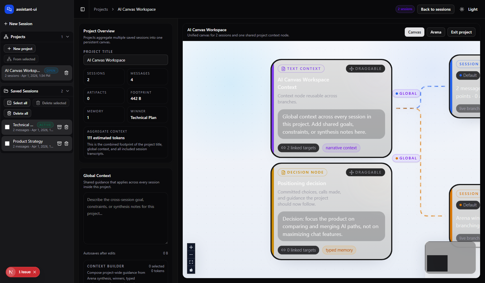
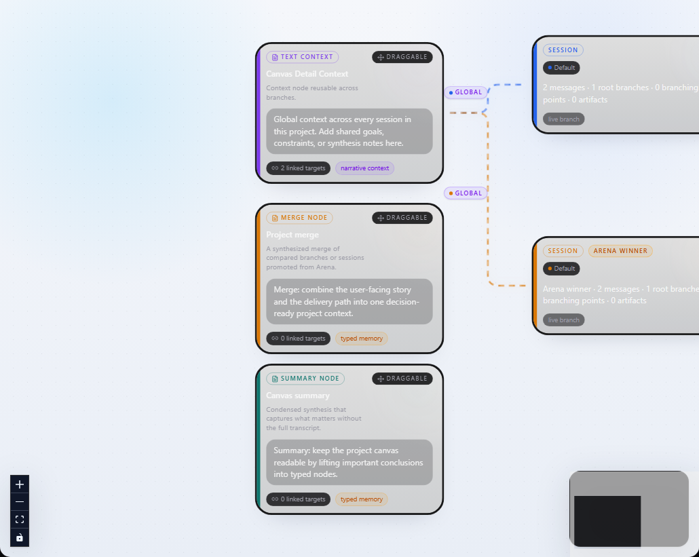
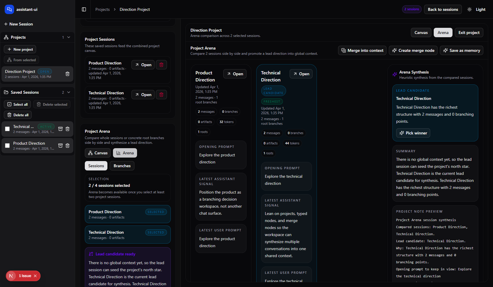
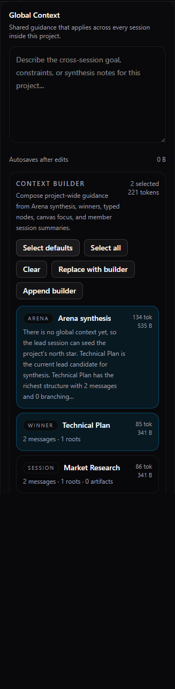

# AI Canvas

AI Canvas is a visual workspace for thinking with AI.

Instead of keeping everything inside one long chat, AI Canvas lets you:

- branch conversations
- compare different directions
- attach extra context like notes, code, files, and images
- group related sessions into projects
- keep working context visible while you iterate

It is best for people who want to explore options before committing to one path.

## License

This project is licensed under the MIT License.

See [LICENSE](LICENSE) for the project license and [THIRD_PARTY_NOTICES.md](THIRD_PARTY_NOTICES.md) for upstream notice details related to `assistant-ui`.

## What Makes It Different

Most AI tools are great at generating one answer.

AI Canvas is built for a different job:

- exploring multiple answers
- keeping the reasoning visible
- comparing branches and sessions
- turning exploration into a reusable decision

The product behaves more like a workspace than a chat window.

## Screenshots

### Main workspace

Chat and canvas stay side by side, so you can branch ideas without losing the thread.



### Project canvas

Projects pull multiple sessions and typed nodes into one larger canvas, so the most important conclusions stay visible in one place.



### Project Arena

Projects let you compare multiple sessions or branches and promote the best direction into shared context.



### Project context builder

Global context can be assembled from structured sources like arena synthesis, winners, typed nodes, and session summaries.



## Main Concepts

### Session

A session is a single working conversation.

You can:

- start a new session
- branch from messages
- reopen saved sessions later
- inspect what context is being sent to the model

### Branch

Branches let you try different directions without losing the original path.

Examples:

- rewrite the same prompt a different way
- ask a follow-up from a specific reply
- compare multiple answers to the same idea

### Artifact

Artifacts are extra pieces of context you can add to the canvas.

Supported artifact types include:

- text
- code
- image
- file

You can attach an artifact to a node and create a new branch that uses that context.

### Project

A project groups multiple sessions into one larger workspace.

Inside a project you can:

- add more than one session
- see them together on a larger canvas
- keep a global project context
- compare sessions or branches in Arena

### Arena

Arena helps you compare options.

You can compare:

- sessions
- branches

Then you can:

- pick a winner
- create a merge node
- promote the result into the project context
- save it as reusable memory

### Beacon

Beacon is the guide inside the canvas.

It helps you understand:

- the node it is standing on
- the branch it is inspecting
- the current focus of the workspace

Beacon is there to guide exploration, not replace your main chat thread.

## What You Can Do Today

- chat with local or hosted models
- switch models from the UI
- choose `Last` or `Full` history mode
- branch from user or assistant messages
- manage saved sessions from the sidebar
- attach artifacts as context
- create projects from multiple sessions
- compare options inside Project Arena
- use merge nodes and reusable memory
- inspect the context that will actually be sent to the LLM

## A Good Way To Use It

One practical workflow looks like this:

1. Create one session for product ideas.
2. Create another for technical architecture.
3. Create another for risks, tradeoffs, or critiques.
4. Add those sessions into a project.
5. Compare them in Arena.
6. Create a merge node from the best thinking.
7. Apply that result to the project context.
8. Keep iterating from there.

This is where AI Canvas is strongest: when you need to compare, synthesize, and decide.

## Quick Start

### Requirements

- Node.js 18+
- npm
- one model provider:
  - OpenRouter for hosted models
  - Ollama for local models

### Install

```bash
npm ci
```

### Create `.env.local`

Use one of these setups.

#### Option A: OpenRouter

Recommended if you want the easiest hosted setup.

```env
OPENROUTER_API_KEY=your-key
OPENROUTER_API_URL=https://openrouter.ai/api/v1
OPENROUTER_REFERER=http://localhost:3000
OPENROUTER_TITLE=ai-canvas
DEFAULT_MODEL=nvidia/nemotron-3-super-120b-a12b:free
NEXT_PUBLIC_DEFAULT_MODEL=nvidia/nemotron-3-super-120b-a12b:free
NEXT_PUBLIC_DEFAULT_PROVIDER=openrouter
```

#### Option B: Ollama

Use this if you want to run local models on your own machine.

```env
OLLAMA_API_URL=http://localhost:11434/api
DEFAULT_MODEL=gemma3:4b
NEXT_PUBLIC_DEFAULT_MODEL=gemma3:4b
NEXT_PUBLIC_DEFAULT_PROVIDER=ollama
```

### Run

```bash
npm run dev
```

Then open [http://localhost:3000](http://localhost:3000).

## Where Your Data Lives

AI Canvas stores workspace data locally on disk.

Typical folders:

- `data/sessions`
- `data/projects`
- `data/session-blobs`

That means:

- your saved sessions persist across restarts
- your projects persist across restarts
- uploaded files and images are stored locally

Your `.env.local` file is ignored by git and is not meant to be committed.

## Notes About Context

AI Canvas lets you inspect what the model is actually seeing.

- `Last` means the model mainly sees the latest prompt
- `Full` means the model sees the full conversation history for that path

Artifacts and project context can also affect what gets sent.

The app includes context budgeting so large artifacts do not overwhelm the prompt.

## Notes About Images And Files

Images and files can be attached as context artifacts.

Whether the model truly understands the original media depends on the model you choose.

In practice:

- some models mainly use metadata or extracted text
- multimodal understanding depends on provider and model support

## Useful Commands

```bash
npm run dev
npm test
npm run test:e2e
npm run build
```

## In Short

AI Canvas is for people who want more than one answer from AI.

It gives you a place to:

- branch ideas
- compare options
- carry context forward
- merge what matters
- and turn messy exploration into clearer decisions
