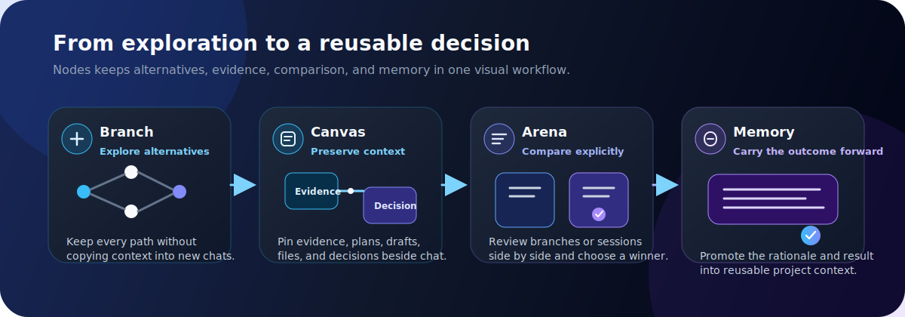
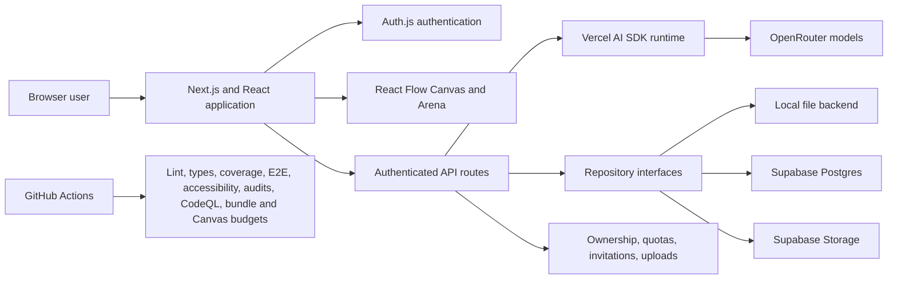

<p align="center">
  
</p>

<h1 align="center">Nodes</h1>

<p align="center">
  <strong>Explore every direction. Keep the decision.</strong>
</p>

<p align="center">
  A branching AI workspace with a visual Canvas, explicit comparison in Arena, and reusable project memory.
</p>

<p align="center">
  <a href="https://github.com/Daedu86/Nodes-AI-Canvas/actions/workflows/ci.yml"></a>
  <a href="https://github.com/Daedu86/Nodes-AI-Canvas/actions/workflows/codeql.yml"></a>
  <a href="LICENSE"></a>
  
  
</p>

<p align="center">
  <a href="docs/product-demo.md"><strong>60-second product demo</strong></a>
  ·
  <a href="#run-the-seeded-demo"><strong>Run the demo</strong></a>
  ·
  <a href="#deploy"><strong>Deploy</strong></a>
  ·
  <a href="ROADMAP.md"><strong>Roadmap</strong></a>
</p>

<p align="center">
  
</p>

Nodes is a workspace for exploration, comparison, and decision-making—not just a single-answer chatbot. It keeps the paths a team considered, the evidence used, and the outcome selected in one connected product workflow.

<p align="center">
  
</p>

## Why Nodes instead of a linear chat?

| Linear chat | Nodes |
| --- | --- |
| One conversation path | Parallel branches from any user or assistant message |
| Important context disappears in scrollback | Persistent Canvas with evidence, plans, drafts, files, and decisions |
| Alternatives are compared manually | Arena compares branches and sessions side by side |
| The winning result remains isolated | Project memory carries the outcome and rationale into later work |
| Teams repeat prompts and context | Projects compose shared context across sessions |

## The product loop in 60 seconds

<table>
  <tr>
    <td width="50%" valign="top">
      
      <br />
      <strong>1. Branch</strong><br />
      Explore competing directions without restarting the conversation or losing the original path.
    </td>
    <td width="50%" valign="top">
      
      <br />
      <strong>2. Preserve context</strong><br />
      Pin evidence, decisions, plans, code, images, files, and prompts to a persistent visual Canvas.
    </td>
  </tr>
  <tr>
    <td width="50%" valign="top">
      
      <br />
      <strong>3. Compare</strong><br />
      Review branches or sessions in Arena and choose a winner explicitly.
    </td>
    <td width="50%" valign="top">
      
      <br />
      <strong>4. Reuse the decision</strong><br />
      Promote the strongest result into project memory and compose it into future context.
    </td>
  </tr>
</table>

The complete narrated sequence is in the [product demo guide](docs/product-demo.md).

## Run the seeded demo

The repository includes a deterministic product workspace with three sessions, a branching positioning conversation, Canvas artifacts, an Arena winner, and promoted project memory. It does not require a live model response.

```bash
npm ci
cp .env.example .env.local
npm run demo:seed
npm run dev
```

On Windows PowerShell:

```powershell
Copy-Item .env.example .env.local
```

Set a local development password in `.env.local`, sign in, and open:

```text
[Demo] Nodes product launch
```

Use `npm run demo:reset` to restore the presentation data and `npm run demo:clean` to remove only the demo records. See [docs/product-demo.md](docs/product-demo.md) for the presentation script and recording sequence.

## Product tour

### Chat and branching

<picture>
  <source media="(prefers-color-scheme: dark)" srcset="docs/readme/01-chat-branching-dark.png" />
  <source media="(prefers-color-scheme: light)" srcset="docs/readme/01-chat-branching.png" />
  
</picture>

Branch from any user or assistant message by editing it or adding a follow-up, then keep parallel paths available instead of overwriting prior work.

### Canvas and artifacts

<picture>
  <source media="(prefers-color-scheme: dark)" srcset="docs/readme/02-canvas-artifacts-dark.png" />
  <source media="(prefers-color-scheme: light)" srcset="docs/readme/02-canvas-artifacts.png" />
  
</picture>

The Canvas is the persistent space for context that should not disappear in scrollback. Artifacts can contain text, code, images, files, or executable prompts, and links make their relationship to prompts and responses visible.

<p align="center">
  
</p>

### Arena

Arena compares branches or sessions side by side. A selected winner can be promoted into memory so the decision and its supporting context remain available after the comparison.

<p align="center">
  
</p>

### Project Context Builder

Projects group sessions and memory. Context Builder composes project-wide guidance from Arena outcomes, typed Canvas nodes, and session summaries.

<p align="center">
  
</p>

### Per-user LLM connections

<picture>
  <source media="(prefers-color-scheme: dark)" srcset="docs/readme/04-llm-models-dark.png" />
  <source media="(prefers-color-scheme: light)" srcset="docs/readme/04-llm-models.png" />
  
</picture>

Users can connect their own OpenRouter credentials and control which models appear in the selector. Stored credentials remain server-side and can use a dedicated encryption key in production.

## What you can do

- Create sessions and branch from user or assistant messages.
- Keep a visual Canvas open while working with AI.
- Pin evidence, decisions, questions, plans, tables, drafts, code, images, and files.
- Run Canvas prompts and keep their results attached to the workspace.
- Group sessions into projects with shared context.
- Compare alternatives in Arena and promote winners into memory.
- Collaborate through secure project invitations and owner, editor, or viewer roles.
- Use a per-user workspace guide and keyboard-accessible primary Chat and Canvas controls.
- Use hosted OpenRouter models or a supported local development configuration.
- Persist locally for development or use Supabase Postgres and Storage in production.

## Common use cases

- **Product and UX iteration:** branch concepts, compare outcomes, and preserve the strongest direction and rationale.
- **Technical design:** keep constraints, evidence, snippets, alternatives, and architectural decisions connected.
- **Research synthesis:** pin evidence, compare interpretations, and carry conclusions across sessions.
- **Writing and planning:** explore competing structures without losing prior versions or selected language.
- **Model evaluation:** run the same problem through different branches or sessions and compare results in Arena.

## Architecture at a glance



| Layer | Implementation |
| --- | --- |
| Application | Next.js, React, and TypeScript |
| AI runtime | Vercel AI SDK with OpenRouter runtime support |
| Authentication | Auth.js with GitHub or Google OAuth in production |
| Persistence | Repository abstraction with file and Supabase implementations |
| Visual workspace | React Flow-based Canvas and Arena |
| Security | Server-side ownership, invitation, credential, upload, and quota enforcement |
| Quality | ESLint, TypeScript, Vitest coverage, Playwright E2E and accessibility checks in Chromium and Firefox, audits, CodeQL, bundle budgets, and Canvas performance budgets |
| Deployment | Vercel reference deployment with Supabase Postgres and Storage |

## Developer quick start

Requirements:

- Node.js 22
- npm
- OpenRouter credentials for live hosted inference, or the seeded demo for a no-inference product tour

```bash
npm ci
cp .env.example .env.local
npm run dev
```

Then open `http://localhost:3000`.

For complete setup and validation commands, see the [development guide](docs/development.md). For production configuration, see the [deploying guide](docs/deploying.md) and [cloud persistence guide](docs/cloud-persistence.md).

## Deploy

<p>
  <a href="https://vercel.com/new/clone?repository-url=https%3A%2F%2Fgithub.com%2FDaedu86%2FNodes-AI-Canvas&env=AUTH_SECRET,NEXTAUTH_URL,NODES_PERSISTENCE_BACKEND,ALLOW_REMOTE_API,SUPABASE_URL,SUPABASE_SERVICE_ROLE_KEY,LLM_SETTINGS_ENCRYPTION_KEY,AUTH_GITHUB_ID,AUTH_GITHUB_SECRET&envDescription=Production%20configuration%20required%20by%20Nodes&envLink=https%3A%2F%2Fgithub.com%2FDaedu86%2FNodes-AI-Canvas%2Fblob%2Fmain%2Fdocs%2Fdeploying.md">
    
  </a>
</p>

A production deployment requires:

- Supabase Postgres and a private Storage bucket;
- a final HTTPS `NEXTAUTH_URL`;
- strong, independent authentication and credential-encryption secrets;
- at least one complete GitHub or Google OAuth configuration;
- `NODES_PERSISTENCE_BACKEND=supabase` and `ALLOW_REMOTE_API=1`;
- explicit OpenRouter funding and quota policy.

The full pre-deploy and post-deploy checklist is in [docs/deploying.md](docs/deploying.md).

## Roadmap and community

- [Public product roadmap](ROADMAP.md)
- [Contribution guide](CONTRIBUTING.md)
- [Security policy](SECURITY.md)
- [Bug reports](https://github.com/Daedu86/Nodes-AI-Canvas/issues/new?template=bug_report.yml)
- [Feature requests](https://github.com/Daedu86/Nodes-AI-Canvas/issues/new?template=feature_request.yml)

Contributions should include focused changes, appropriate tests, and a clear description of user-visible or operational impact. Security vulnerabilities must be reported privately through the process in [SECURITY.md](SECURITY.md), not through a public issue.

## Project status

Nodes is under active development toward a stable `1.0` product. Interfaces, persistence details, and operational defaults may evolve. The current repository version is `0.1.0`; the roadmap distinguishes available capabilities from planned work.

The prepared social preview artwork is available at [`docs/brand/nodes-social-preview.svg`](docs/brand/nodes-social-preview.svg).

## License

This project is licensed under the MIT License.

See [LICENSE](LICENSE) and [THIRD_PARTY_NOTICES.md](THIRD_PARTY_NOTICES.md) for upstream notices related to `assistant-ui`.
